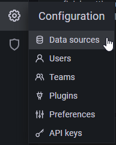

# Configuración de Node-Red con influxDB y Grafana

El Servidor virtual con OS Ubuntu 20.04 contiene los servicios de Node-Red, InfluxDB y Grafana como se muestra en la siguiente imagen. Node-Red soporta los protocolos de la capa de aplicación que se van a utilizar: CoAP y MQTT. Adicionalmente, desde el nodo correspondiente en Node-Red, se establece la conexión con InfluxDB para el almacenamiento de los datos. La visualización de los datos se realiza usando Grafana, el cual, alimenta sus gráficos con los datos de la base de datos que está en InfluxDB.

<p align="center">
  
</p>

- Contenido
  - [Conexión entre Node-Red e InfluxDB](#conexión-entre-node-red-e-influxdb)
  - [Conexión entre Grafana e InfluxDB](#conexión-entre-grafana-e-influxdb)


## Conexión entre Node-Red e InfluxDB
<p align="center">
  
</p>

1. Acceda a InfluxDB desde http://192.168.56.1:8086. En el menú de la columna izquierda, seleccione la opción _Data_ y luego en las pestañas en _API Tokens_. 

<p align="center">
  
</p>

2. Abra el Token correspondiente y copie el valor al _Clipboard_.

<p align="center">
  
</p>

3. Acceda a Node-Red desde http://192.168.56.1:1880. Agregue el nodo _influxdb out_ al área de trabajo y haga doble _click_ sobre este.

<p align="center">
  
</p>

4. Una vez se abra la columna de configuración del nodo, agregue un _server_ haciendo _click_ en la opción mostrada a continuación.

<p align="center">
  
</p>

5. Luego de que se abra la ventana de configuración, asigne un nombre a la conexión con InfluxDB y ajuste los siguientes campos. Utilice el _Token_ del **paso 2** y haga _click_ en _add_.

<p align="center">
  
</p>

6. En la columna de configuración del nodo _influxdb out_, Complete los siguientes campos, donde _Server_ es el servidor creado en el paso anterior, _Organization_, _Bucket_ y _Measurement_ son los que se encuentran preconfigurados en InfluxDB, donde _Bucket_ puede entenderse como la Base de Datos y _Measurement_ como la tabla con las columnas y sus valores respectivos.
  
<p align="center">
  
</p>

7. En Node-Red comple el flujo con los siguientes nodosy conexiones.

<p align="center">
  
</p>

8. Configure el nodo _inject_ para qué periódicamente le envíe un _msg.payload_ vacío al nodo _function_. **Recuerde deshabilitar la periodicidad al final de este procedimiento para evitar llenar la tabla con valores innecesarios.**

<p align="center">
  
</p>

9. Agregue el siguiente fragmento de código al nodo _function_ y haga _click_ en _Deploy_.
```
  msg.payload = {
    name: "Nombre de Nodo IoT",
    temp: 25,
    humidity: 65,
    battery: 35
  }
  return msg;
```

10. Una vez realizado lo anterior, verifique en InfluxDB, en la opción _Explore_ que el _Bucket_ y la tabla _Measurements_ se muestren de la siguiente forma o similar.

<p align="center">
  
</p>

## Conexión entre Grafana e InfluxDB

<p align="center">
  
</p>

1. Acceda a Grafana desde http://192.168.56.1:3000. En el menú de la columna izquierda, vaya a configuración y _Data Sources_.

<p align="center">
  
</p>

2. Haga _Click_ en _Add data source_ y seleccione la opción de InfluxDB.

<p align="center">
  
</p>

3. Complete los campos e ingrese los datos de la base de datos de InfluxDB para que Grafana pueda acceder a los valores de las tablas (_Measurements_).

<p align="center">
  
</p>

4. Luego de crear la conexión de Grafana con InfluxDB, agregue un panel al _Dashboard_ para mostrar los valores que seleccionen mediante el **_Query_** correspondiente. 

<p align="center">
  
</p>

  - Para este ejemplo, la consulta (_Query_) que está acontinuación, permite mostrar los valores del campo o columna _temp_. 

```
from(bucket: "iccs-lab-influxdb")
  |> range(start: -5m, stop:now())
  |> filter(fn: (r) =>
    r._measurement == "medidas_ejemplo1" and
    r._field == "temp"
  )
```


