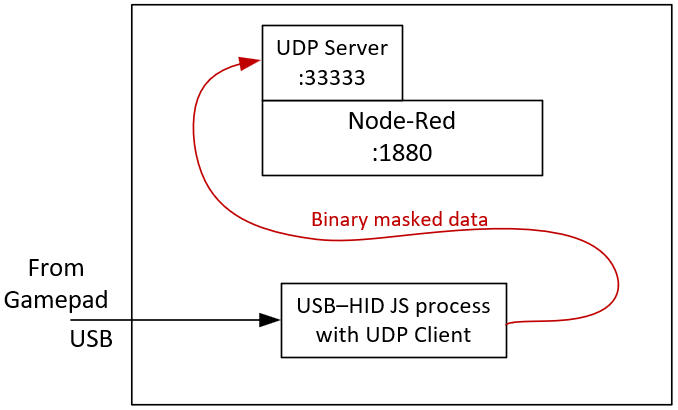
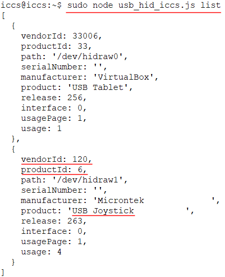
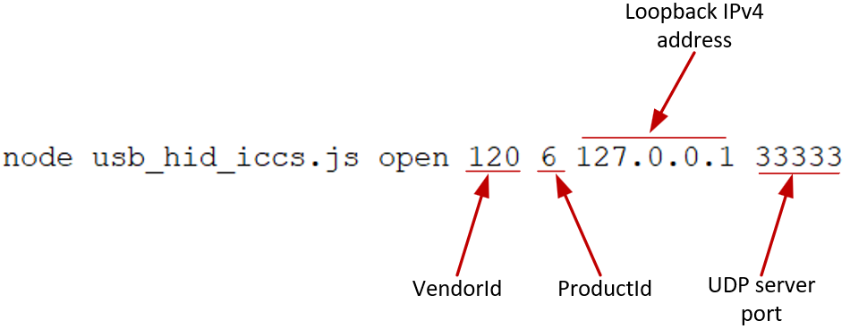
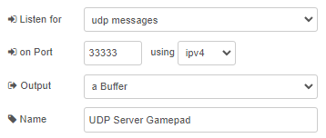

# Conexión de Gamepad a Node-Red

Generalmente, los valores recibidos de un control de mando, o, para este caso, de un Gamepad, son datos binarios enmascarados recibidos desde el periférico USB al cual fue conectado.

Como para este caso se utiliza VirtualBox, se requiere la configuración USB correspondiente en el Guest para que, el Servidor virtual con OS Ubuntu 20.04 y con el servicio de Node-Red, reconozca el periférico conectado al Host físico.

Una vez realizada la conexión y la configuración en VirtualBox, los datos recibidos desde el control de mando, son enviados a Node-Red a través de un proceso implementado en Node.js. Esto se muestra en el siguiente diagrama.

<p align="center">
  
</p>

El proceso _USB–HID JS process with UDP Client_ se describe a continuación.

- Contenido
  - [Prerrequisitos](#prerrequisitos)
  - [Proceso USB-HID en NodeJS](#proceso-para-recepción-de-datos-usb-y-transmisión-a-node-red)
  - [Recepción de datos en Node-Red](#conexión-de-gamepad-a-node-red)
  - [Referencias](#referencias)

## Prerrequisitos

Realizar las siguientes instalaciones.

```
sudo apt install build-essential git pkg-config
sudo apt install libudev-dev
sudo apt install libusb-1.0-0 libusb-1.0-0-dev
```
```
npm install node-hid --build-from-source
```

Ver referencias para mayor información.

## Proceso para recepción de datos USB y transmisión a Node-Red

El programa __*usb_hid_iccs.js*__ se ejecuta con permisos de administrador (_sudo_) teniendo en cuenta la estructura de sus argumentos de entrada (_list_ o _open_).

En primer lugar, para ver los identificadores necesarios del periférico USB conectado, se ejecuta __*usb_hid_iccs.js*__ con el argumento _list_ 

```
node usb_hid_iccs.js list
```
Luego de identificar cual es el control de mando, se identifica su _vendorId_ y _productId_. En el ejemplo a continuación se muestra el resultado para un producto llamado _USB Joystick_.

<p align="center">
  
</p>

Luego, se ejecuta __*usb_hid_iccs.js*__ nuevamente pero con el argumento _open_ y los demás argumentos de configuración.
```
node usb_hid_iccs.js open 120 6 127.0.0.1 33333
```
<p align="center">
  
</p>

Al final del comando anterior, se le puede agregar un _ampersand_ (&) Para que su ejecución se realice en _segundo plano_. Tenga en cuenta que, por defecto, luego de cada reinicio del OS ubuntu se debe ejecutar nuevamente el proceso __*usb_hid_iccs.js*__


## configuración en Node-Red

Agregar al área de trabajo un nodo _udp in_, haga doble _click_ en el mismo y configúrelo.

<p align="center">
  
</p>

Puede verificar el funcionamiento conectándolo a un nodo _debug_.


## Referencias

- https://www.npmjs.com/package/node-hid
- https://github.com/node-hid/node-hid

otras:
- https://flows.nodered.org/node/node-red-contrib-usbhid
- https://www.npmjs.com/package/node-red-contrib-usbhid
- https://github.com/somebuddy87/node-red-contrib-usbhid
